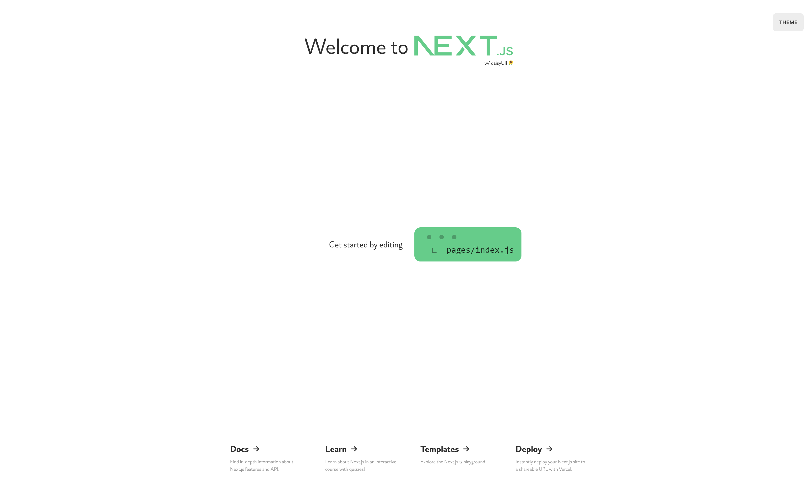

# Next.js starter with TypeScript and daisyUI

This is a Sample Starter I configured for personal use. If you find it useful feel free to use it.

## Configured in starter:
- Next.js 13
- Typescript
- TailwindCss w/ PostCss nesting
- daisyUi w/ themes
- theme-change
- SVGr
- eslint
- prettier w/ prettier-plugin-tailwindcss
- Fonts: Inter, Alpino, Satoshi
- .vscode configs (delete if unwanted)

# Preview [Here](https://daisy.toph.cc)

